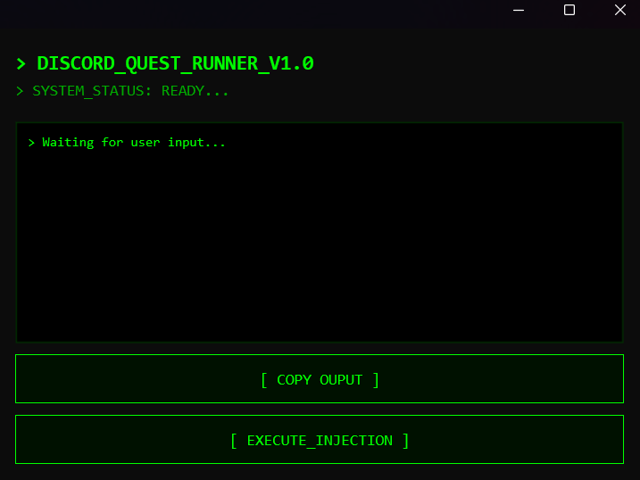

# Discord Quest Runner

Advanced tool to automatically complete Discord Quests and claim rewards.

This project uses a .NET MAUI application to communicate with the Discord client (via WebSocket), simulating the necessary actions to complete quests (playing games, watching streams) and automatically claiming rewards.

## Features

- **Full Automation**: Automatically completes Game and Streaming missions.
- **Auto-Claim**: Automatically claims rewards upon quest completion.
- **Injection**: Uses Discord's Debug protocol to execute safe scripts.

## Interface

## How to Use

1. Open the **DiscordQuestRunner** application.
2. Click the **"EXECUTE INJECTION"** button.
3. The app will detect Discord. If necessary, it will prompt to restart Discord in Debug mode (accept the prompt).
4. Once the script is injected, it will automatically start finding quests, completing them, and claiming rewards.
5. Follow the progress via the logs in the application.

## Requirements

- Windows 10/11
- Discord Desktop Application

## Development

Developed using C# and .NET MAUI.
The logic script is written in JavaScript and executed within the Discord context.
